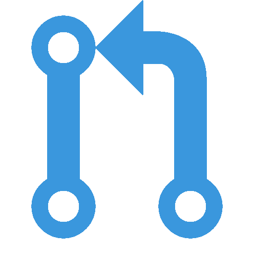

<!--  최상단 배너 (이름)  -->

<!-- 포트폴리오  -->

<!-- Career 정리 -->
## 💼Career

- **슈어소프트테크**(주)<a href="https://www.suresofttech.com/">🔗</a> / AI기술팀 인턴(2024.07 ~ 2024.11)
  > * Task 특화 LLM 개발
  > * LLM as Judge Benchmark 구축
  > * Streamlit 기반 Chat-UI 개발

<!-- Award 정리 -->
## 🏆Award

- **[은상] K-디지털 챌린지: NET 챌린지 캠프**시즌10<a href="https://github.com/sts07142/GuardianWatch">🔗</a> / 팀장(2023.07 ~ 2023.12)
  > * **과학기술정보통신부** 주최
  > * 네트워크 응용분야 아이디어 공모전
  > * 다중 객체 추적 기술을 활용한 지능형 어린이집 안전 모니터링 시스템

<!-- Activity 정리 -->
## 🚀Activity

- **INC Lab.**<a href="https://sites.google.com/gachon.ac.kr/inclab">🔗</a> / Undergraduate RA (2023.03 ~ 2024.06)
  > * **지능정보통신연구실**
  > * WiFi CSI sensing for Human Activity Recognition
  > * Distributed Human Activity Recognition System for Scalable Wi-Fi sensing

- **BDA**<a href="https://cafe.naver.com/officialbac">🔗</a> / 8기 학회원(2024.03 ~ 2024.09)
  > * **빅데이터학회 Big Data Analysis**
  > * EDA & 데이터 분석
  > * 확률 통계 분석
  > * NLP 모델 분석

<!-- Project 정리 -->
## 📂Project

<!-- 하루한알 -->
- <b>영양제 추천 앱, 하루한알</b>2023 <a href="https://github.com/sts07142/HaruHanal-BackEnd">🔗</a> / 개발 팀원 (2022.10 ~ 2022.11)
  > * 어떤 영양제를 선택할지 어려울 때, 하루한알 / Haru-Hanal 
  > * GPT 기반 사용자 맞춤 영양제 추천 시스템 개발
 
<!-- 실내 네비게이션 -->

<!-- 스마일게이트 온라인 게임잼 -->
- <b>스마일게이트 온라인 게임잼</b>2022 <a href="https://page.onstove.com/indieboostlab/global/view/8210526">🔗</a> / 개발 팀원 (2022.02 ~ 2022.02)
  > * 봄을 기다리곰 : 불면증에 걸려 겨울잠을 자지 못한 곰의 생존 이야기<a href="https://store.onstove.com/ko/games/829?_gl=1%2au3wiog%2a_ga%2aMTA4ODE4OTQ5LjE3MDIzNzI0NTY.%2a_ga_H211STCMYT%2aMTcwMjM3MjU3MC4xLjEuMTcwMjM3Mjc3Mi42MC4wLjA.%2a_ga_GELB69ZD7J%2aMTcwMjM3MjU3NC4xLjEuMTcwMjM3Mjc3Mi42MC4wLjA.">🔗</a> / 팀 베어그릴스
 
<!-- DACON 프로젝트 Archive -->

- **DACON 프로젝트 Archive**<a href="https://github.com/sts07142/DACON-Archive">🔗</a><b></b>
  > * Dacon 주최 ML/DL AI 공모전 참가
 

<!-- 오픈소스 기여 정리 -->
## 👋OpenSource Contributions

> langflow-ai/langflow

> OpenBMB/ChatDev

> stitionai/devika

> context-labs/autodoc

> OpenBMB/RepoAgent

> pqrs-org/KE-complex_modifications

> hiyouga/LLaMA-Factory

<!-- Stats 정리 -->
## ✨️Stats 

<a href="https://github.com/sts07142">
  
  
<!-- 
<a href="https://github.com/sts07142">
   -->
</a>

<!-- Stack 정리 -->
## 📚Stack

  
  
  
  
  
  
  
   
  
  
  
  
  
  
  
  
  
  

